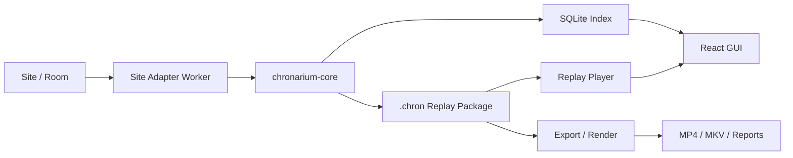

# Chronarium Architecture

This document records the first architecture framework for Chronarium. It is a
living source of truth, not a completed implementation report.

## Objective

Build a local-first livestream archive and replay platform that preserves media,
events, state changes, diagnostics, and timing relationships as durable facts.

Chronarium should support:

- site-specific capture logic;
- append-friendly timelines;
- replayable session archives;
- custom replay UI;
- derived video exports;
- fixture-driven AI maintenance.

## Core Principle

```text
Record facts first. Render videos later.
```

The primary artifact is a session archive. MP4, MKV, clips, reports, and replay
views are derived artifacts.

## Default Stack

```text
Primary language: TypeScript
Desktop shell: Electron
GUI: React + TypeScript + Vite
Core backend: Node.js + TypeScript
Adapter isolation: child processes
Contracts: shared TypeScript types + schema validation
Fact logs: JSON Lines
State/index DB: SQLite
Media tools: FFmpeg / ffprobe through typed command builders
Offline analysis: Python scripts allowed
```

The stack is intentionally TypeScript-first to reduce AI maintenance cost and
keep UI, backend, adapters, schemas, and tests close together.

## Process Model

```text
Electron Main
  -> starts and supervises chronarium-core
  -> owns desktop lifecycle only

React Renderer
  -> shows session state, timelines, replay, settings, diagnostics
  -> talks to core through a narrow IPC/API client

chronarium-core
  -> owns tasks, archive writes, SQLite index, adapter lifecycle
  -> exposes typed local APIs to GUI

Site Adapter Workers
  -> one process per site/session boundary as needed
  -> discover media, room state, chat/events, and stream decisions
  -> emit structured facts to core

FFmpeg / ffprobe Workers
  -> invoked through typed command builders
  -> produce exports, probes, previews, and diagnostics
```

Electron main must not become the application backend. GUI must not run capture
or site logic directly.

## Data Flow



## Replay Package Shape

The first schema and fixture writer path now exists for `manifest.json`,
`timeline.jsonl`, top-level archive directories, manifest/timeline
reader-validation, and a rebuildable SQLite indexer derived from synthetic
archives. The broader package shape is still the design target:

```text
<session-id>.chron/
  manifest.json
  timeline.jsonl
  tracks/
    video/
      track.json
      segments/
    audio/
      track.json
      segments/
  events/
    room.jsonl
    chat.jsonl
    paid-room.jsonl
  diagnostics/
    adapter.jsonl
    network.jsonl
    gap-decisions.jsonl
  exports/
    README.md
```

Guidelines:

- `manifest.json` describes the package and stable IDs.
- `timeline.jsonl` is the session-level fact stream.
- `tracks/*/segments` stores media facts, not necessarily final video files.
- `events/*.jsonl` stores domain-specific event streams.
- `exports/` contains derived outputs and may be deleted/rebuilt.
- Package writes should prefer temporary files followed by atomic finalization.

## Timeline Semantics

Timeline events should distinguish:

- observed source facts;
- Chronarium decisions;
- derived summaries;
- export-only events.

Planned event families:

```text
session.*
adapter.*
media.track.*
media.segment.*
media.gap.*
room.*
chat.*
paid_room.*
network.*
export.*
diagnostic.*
```

Each event should include:

- stable event type;
- session ID;
- adapter ID when applicable;
- source time when known;
- capture time;
- monotonic local sequence;
- payload schema version;
- redaction status for sensitive source fields.

## Component Boundaries

### Renderer

Responsibilities:

- workspace UI;
- task and session dashboards;
- replay player;
- timeline exploration;
- settings and diagnostics.

Must not:

- fetch site media;
- parse provider-specific protocols;
- mutate archives directly;
- invoke FFmpeg or shell commands.

### Electron Main

Responsibilities:

- window lifecycle;
- app lifecycle;
- starting/stopping `chronarium-core`;
- safe IPC bridge.

Must not:

- contain site adapter logic;
- own SQLite schema;
- write replay packages;
- expose broad filesystem or process permissions to the renderer.

### chronarium-core

Responsibilities:

- task lifecycle;
- adapter lifecycle;
- archive writes;
- timeline appends;
- SQLite indexing;
- export job orchestration;
- diagnostic collection.

Must not:

- hard-code site protocol details that belong in adapters;
- expose arbitrary shell execution;
- store raw secrets in logs, SQLite, timeline, or archives.

### Site Adapter

Responsibilities:

- site login/session handling through safe credential references;
- room discovery;
- online/paid/private state discovery;
- media playlist and segment discovery;
- stream gap and reconnect decisions;
- chat/event capture when supported;
- emitting structured facts to core.

Must not:

- write final archives directly without core mediation;
- mutate global application state;
- call unrelated site adapters;
- leak raw cookies, headers, tokens, or signed URLs into shareable logs.

## Hot Maintenance Model

Chronarium should make site repair local:

```text
CB media issue -> update CB adapter fixtures/tests/code
SC room-state issue -> update SC adapter fixtures/tests/code
Archive schema issue -> update shared schema and migration
Player sync issue -> update player/replay logic
```

Avoid changes that require touching every site for one site's behavior.

## AI Maintainability Model

AI maintainability is a first-class architecture requirement.

Use:

- TypeScript-first code;
- shared schema package;
- short modules;
- fixture-heavy tests;
- explicit process boundaries;
- plain file formats;
- docs that reflect current facts;
- deterministic replay of failures.

Avoid:

- giant cross-site abstractions;
- hidden global mutable state;
- adapter behavior embedded in GUI;
- magic retry loops;
- undocumented thresholds;
- binary-only facts that cannot be inspected by future agents.

## Initial MVP Direction

The first implementation should not attempt every site or a complete GUI.

Recommended first MVP:

1. Create TypeScript workspace.
2. Define core schemas for `LiveSession`, `ArchiveManifest`, `TimelineEvent`,
   `MediaTrack`, and adapter messages.
3. Implement local `.chron` package writer with synthetic fixtures.
4. Implement `.chron` manifest/timeline reader-validation and a rebuildable
   SQLite indexer from replay packages.
5. Add index rebuild/query contracts before wiring SQLite into core or GUI.
6. Build a minimal React UI that opens a fixture package and shows timeline
   events.
7. Add a CB adapter fixture harness before connecting to live rooms.

## Deferred Decisions

These decisions are intentionally deferred:

- final package extension;
- final plugin distribution/update mechanism;
- multi-site generic adapter interface;
- native module needs;
- signed update channel;
- public fixture policy;
